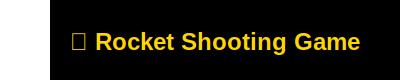

  

<!---->

  

<!--<h1 align="center"><b>Hi, I'm OBAID</b> </h1>-->

  
<h2>👨‍🎓 About Me</h2>

  - 🎓 **First-Year BS Computer Science Student** – FAST NUCES Karachi  
  - 💻 **Aspiring Software & Game Developer** | Tech Enthusiast  
  - 🚀 **Eager to Learn & Explore** – C, C++, Python, OOP, and Web Development  
  - ✨ **Passionate About Problem-Solving & Building Projects**  
  - 🌱 **Learning About:** Object-Oriented Programming  

  ### 📬 Connect with Me:
  

    
    
    
    
  

  
<h2>🛠️ Tech Stack</h2>

  <h3>Programming Languages & Web Development</h3>  
  

    
  

  <h3>Tools & Technologies</h3>  
  

    
    
  

  
<h2>📈 GitHub Stats</h2>

  <h3>💻 GitHub Profile Stats</h3>
  

    
    
  

<h3>📊 Contribution Graph</h3>

  

<h3>📋 Profile Summary</h3> 

  

  
<h2>🚀 Featured Projects</h2>

  
  

  
<h2>👨‍💻 Repositories</h2>

   

  

    
    
    
    
  

   
  <h4 align="center">
    <a href="https://github.com/Obaid03?tab=repositories" title="Show Repositories">🔎 Show More 🔍</a>
  </h4>

  

